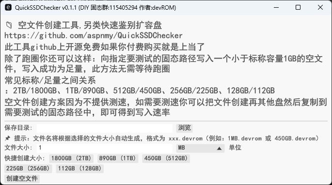

# 📁 QuickSSDChecker (DIY 固态群:115405294)

## 📖 项目介绍

这是一个基于 Rust 开发的 SSD 容量检测工具，主要用于快速鉴别固态扩容盘。通过向目标设备写入特定大小的空文件，可以快速验证设备是否为扩容盘，无需等待跑圈测试。

## ✨ 功能特性

- 🚀 **快速鉴别**：无需等待跑圈，直接写入空文件验证容量
- 📏 **多种大小**：支持 128GB/112GB、256GB/225GB、512GB/450GB、1TB/890GB、2TB/1800GB 等常见容量
- 📁 **自动命名**：根据选择的大小自动生成文件名，格式为 `xxx.devrom`
- 📱 **自适应界面**：根据系统分辨率自动调整窗口大小
- 🇨🇳 **中文支持**：完全中文界面，使用系统字体确保中文显示正常
- 🔒 **权限检查**：自动检测管理员权限，确保文件创建成功
- ⚡ **优化体验**：目录选择优化，响应迅速

## 📋 使用方法

1. **选择保存目录**：点击"浏览"按钮选择要保存文件的目录
2. **设置文件大小**：
   - 手动输入大小和选择单位（B/KB/MB/GB）
   - 或直接点击快捷按钮选择预设大小
3. **创建文件**：点击"创建空文件"按钮，系统将自动创建指定大小的空文件
4. **查看结果**：根据状态提示了解文件创建情况

## 🎯 扩容盘鉴别原理

向指定测试的固态路径写入一个小于标称容量1GB的空文件，写入成功则为足量盘，写入失败则为扩容盘。

### 常见标称/足量关系
- 2TB → 1800GB
- 1TB → 890GB  
- 512GB → 450GB
- 256GB → 225GB
- 128GB → 112GB

## 🖥️ 系统要求

- **操作系统**：Windows 10/11
- **权限**：需要管理员权限才能创建大文件
- **依赖**：无需额外安装依赖，单文件可执行

## 🔧 构建说明

### 开发环境
- Rust 1.70+ (2024 edition)
- Windows 10/11

### 构建命令
```bash
# 开发构建
cargo build

# 发布构建
cargo build --release
```

### 构建产物
- 开发版本：`target/debug/rust_file_creator.exe`
- 发布版本：`target/release/rust_file_creator.exe`

## 📁 项目结构

```
rust_file_creator/
├── .gitignore          # Git忽略文件
├── Cargo.lock          # 依赖锁定文件
├── Cargo.toml          # 项目配置文件
├── build.rs            # 构建脚本
├── icon.rc             # 资源文件
├── img/                # 图标资源目录
│   └── devrom.ico      # 应用图标
└── src/
    └── main.rs         # 主程序代码
```

## 📄 许可证

本项目采用 MIT 许可证，详情请查看 [LICENSE](LICENSE) 文件。

## 🤝 贡献

欢迎提交 Issue 和 Pull Request 来改进这个项目。

## 📞 联系方式

- DIY 固态群：115405294
- 项目地址：[GitHub 开源免费](https://github.com/aspnmy/rust_file_creator)

## ⚠️ 注意事项

1. 本工具仅用于空文件创建，不提供写入测速
2. 如需测速，可将文件创建在其他盘然后复制到需要测试的固态路径中
3. 使用本工具时，请确保目标设备有足够的剩余空间
4. 为避免数据丢失，请谨慎操作
5. 本工具 GitHub 上开源免费，如果你付费购买就是上当了

---

**更新日期**：2026-01-07
**版本**：v0.1.1
